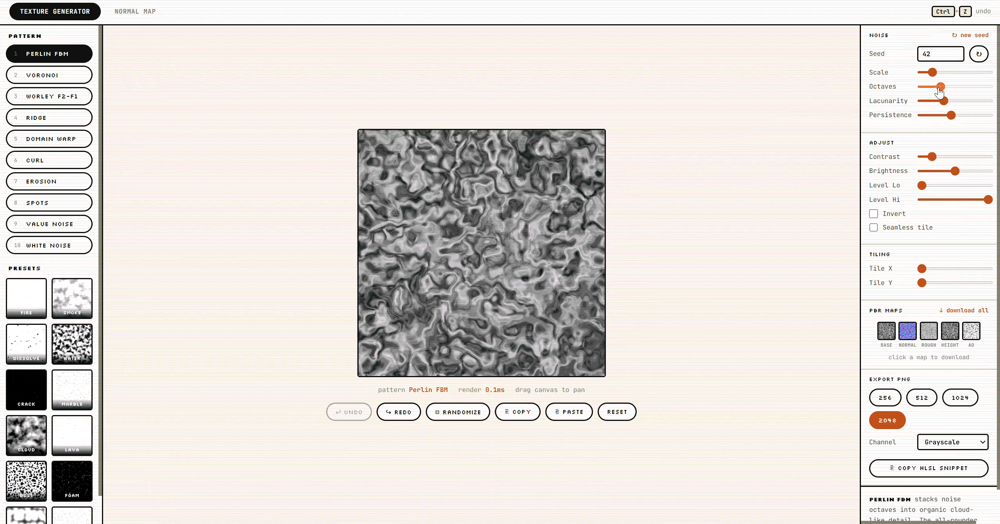

<div align="center">

# Texture Lab

*A browser-based procedural texture authoring tool. Real-time GPU generation, built from scratch with TypeScript and raw WebGL.*

[](https://songwutmee.github.io/texture-lab/)

</div>

<p align="center">
  <a href="https://songwutmee.github.io/texture-lab/">
    
  </a>
</p>

<p align="center">
  
  
  
  
  
</p>

Every texture is generated live on the GPU, so dragging a slider updates the preview with no lag. It is aimed at game art work: build noise patterns for smoke, dissolve masks and terrain without opening Photoshop, and turn any heightmap into a full PBR set. The same generation logic ships as a small Python CLI for batch jobs.

***

### Technical Architecture

I wrote the whole thing on raw WebGL to keep full control of the render loop and stay fast while sliders move.

* **GPU-driven generation.** Every noise pattern is a GLSL fragment shader. Because the GPU shades all pixels in parallel, the preview stays interactive while a slider moves and exports scale to 2048px with no code change. Shared math (simplex, FBM, Voronoi, curl) lives in a single `common.glsl` that gets spliced into each shader at build time.

* **Seamless polar patterns.** To wrap a noise pattern around a circular shape without the usual seam at the angle wrap, I sample the noise along a reconstructed unit circle from the pixel's angle instead of the raw UV, so the pattern meets itself cleanly and no cut shows.

* **Normal maps on the CPU.** Converting a heightmap to a normal map needs each pixel's neighbours, so this is a per-pixel Sobel or Scharr gradient pass over the Canvas 2D API. It outputs normal, displacement and ambient occlusion together, with an Invert-G toggle for OpenGL (Unity) versus DirectX (Unreal).

* **Shareable state.** The full parameter set is serialized into the URL hash as base64, so the address bar alone reproduces an exact texture. No backend and nothing to save.

* **Pipeline CLI.** A set of Python tools (NumPy and Pillow) mirror the browser workflow for automation: generate a texture pack from a JSON config, pack four grayscale masks into one RGBA texture, or watch a folder and auto-derive normal, AO and packed maps whenever a heightmap is dropped in.

***

### Tools

| Tab | What it does |
|-----|--------------|
| **Texture Generator** | 10 GPU noise patterns, 12 presets, seamless tiling, PBR map set (zip export), HLSL snippet export |
| **Normal Map** | Drag a heightmap or pull it from the generator, tune Sobel/Scharr, export normal / displacement / AO |

### Run locally

```bash
npm install
npm run dev      # http://localhost:5173
npm run build    # static build in dist/
```

On Windows, double-clicking `start.bat` does the same and opens the browser.

### CLI tools

```bash
pip install -r python/requirements.txt

# generate a texture pack from one JSON config
python python/batch_export.py --config python/vfx_pack.example.json --output ./textures/

# pack four grayscale masks into one RGBA texture
python python/channel_pack.py --r smoke.png --g fire.png --b dissolve.png --output packed.png

# watch a folder and auto-build height / normal / AO / packed from any dropped heightmap
python python/watch_export.py --watch ./raw/ --output ./processed/
```

## License

MIT. See [LICENSE](LICENSE).
